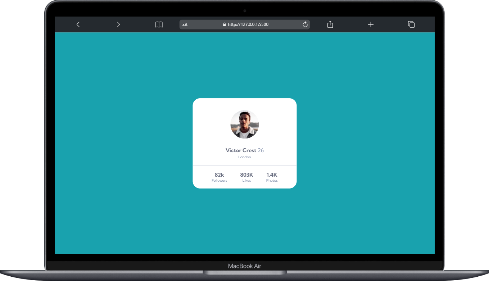
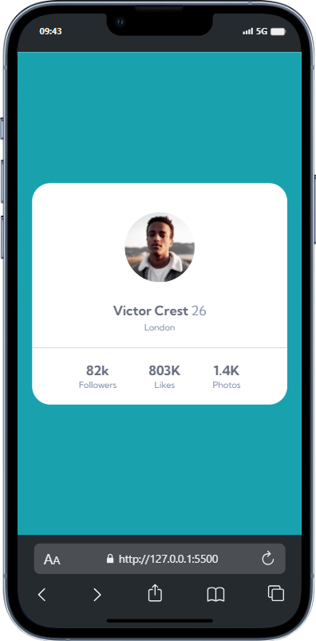

#  Cartão de Perfil - Followers Likes Photos 😍

## Visão Geral 🚀 
Bem-vindo ao meu projeto Cartão de Perfil interativo criado com HTML e CSS, destacando o poder e a flexibilidade do modelo Flexbox! Este é um exemplo de como criar um cartão de perfil simples usando HTML e CSS, com um layout flexível.

## Como Usar 🚀
1- Abra o arquivo index.html em seu navegador favorito.

## Estrutura do Projeto 📂
**index.html**:
 O código HTML está organizado de forma lógica, garantindo uma estrutura clara e semântica.

**style.css**:
 Este arquivo CSS é responsável por estilizar a página e torná-la visualmente atraente.

**img**: Pasta que armazena as imagens, incluindo o ícones.

## Preview 📸

## Personalização 🎨
Sinta-se à vontade para personalizar o  cartão de perfils de acordo com suas preferências. Você pode modificar o estilo, adicionar mais funcionalidades ou integrá-lo a outras tecnologias.

## Tecnologias Utilizadas  💻
**HTML**: A linguagem de marcação padrão para criar a estrutura da página.

**CSS**: Utilizando Flexbox, o CSS cria um design responsivo e agradável.

## Contribuição 🤝
Contribuições são bem-vindas! Se você encontrar bugs ou tiver sugestões de melhorias, sinta-se à vontade para abrir uma issue ou enviar um pull request.

### Espero que este  cartão de perfil inspire e ajude você a entender melhor como utilizar o Flexbox para criar layouts incríveis! Se tiver dúvidas ou sugestões, não hesite em entrar em contato. Divirta-se codificando! 😊 

## Contato 📲

### me segue nas redes abaixo!
 

 
  
  
  
  

