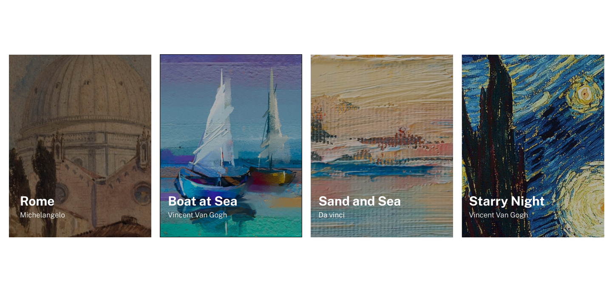

#  Exercício de Lista com Imagens usando HTML e CSS com Flexbox 💻

## Visão Geral 🚀 
Este é um exercício simples para praticar o uso de HTML e CSS, especialmente aproveitando as propriedades do Flexbox para criar uma lista de imagens responsiva e visualmente atraente.

## Objetivo 🎯
O objetivo deste exercício é criar uma lista de imagens flexível e responsiva, utilizando HTML para estruturação e CSS com Flexbox para o layout.

## Como Usar 🚀
1- Abra o arquivo index.html em seu navegador favorito.

## Estrutura do Projeto 📂
**index.html**:
 O código HTML está organizado de forma lógica, garantindo uma estrutura clara e semântica.

**style.css**:
 Este arquivo CSS é responsável por estilizar a página e torná-la visualmente atraente.

**img**: Pasta que armazena as imagens.

## Preview 📸

## Dicas 🌟
Consulte a <a href="https://developer.mozilla.org/pt-BR/docs/Learn/CSS/CSS_layout/Flexbox" target="_blank">Documentação do Flexbox</a>
 para entender como usá-lo eficientemente.

Use media queries para garantir que a lista seja visualmente agradável em diferentes tamanhos de tela.

Experimente diferentes propriedades e valores CSS para personalizar o layout e o design conforme preferir.

## Personalização 🎨
Sinta-se à vontade para contribuir para este exercício. Se encontrar algum problema ou tiver sugestões de melhorias, abra uma issue ou envie um pull request.

## Tecnologias Utilizadas  💻
**HTML**: A linguagem de marcação padrão para criar a estrutura da página.

**CSS**: Utilizando Flexbox, o CSS cria um design responsivo e agradável.

## Contribuição 🤝
Contribuições são bem-vindas! Se você encontrar bugs ou tiver sugestões de melhorias, sinta-se à vontade para abrir uma issue ou enviar um pull request.

### Espero que este exercício inspire e ajude você a entender melhor como utilizar o Flexbox! Se tiver dúvidas ou sugestões, não hesite em entrar em contato. Divirta-se codificando! 😊 

## Contato 📲

### me segue nas redes abaixo!
 

 
  
  
  
  

